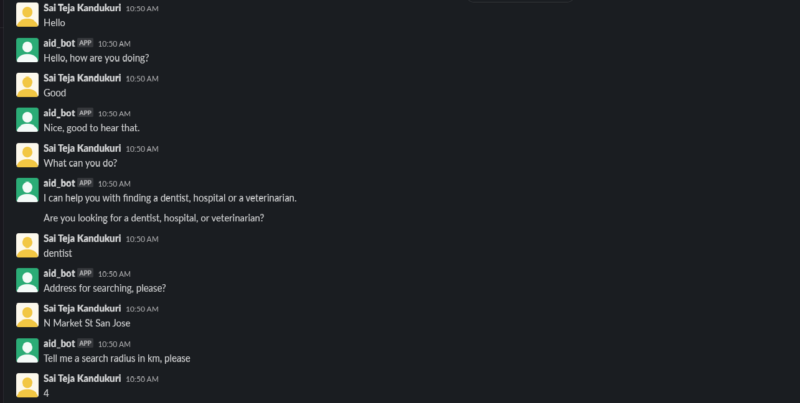
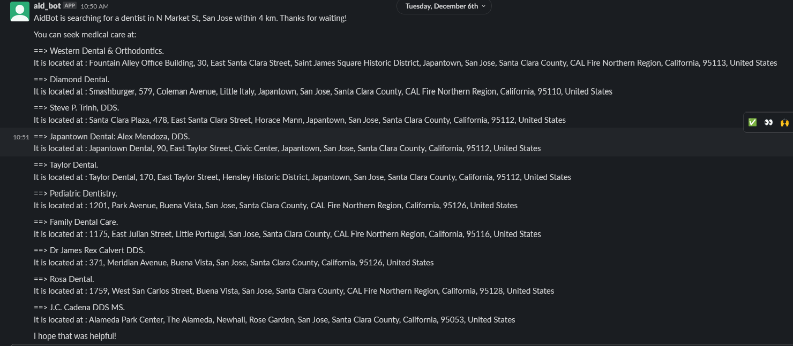
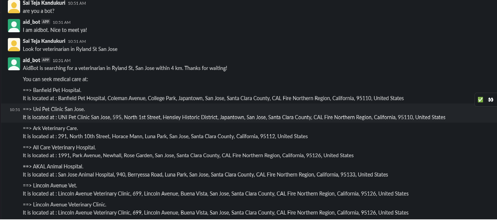
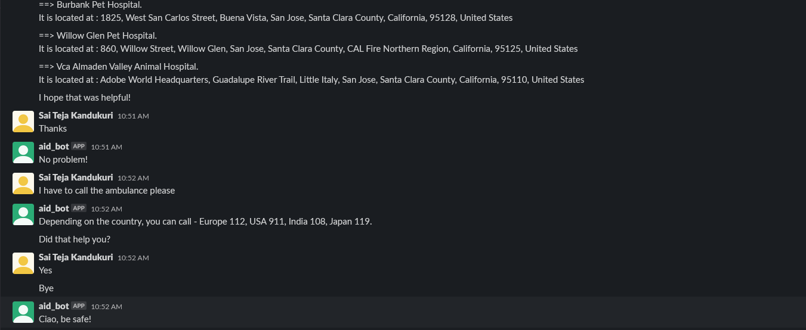
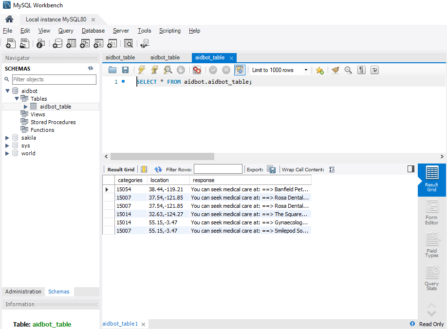

# CMPE 252 Term Project - AidBot

---
Name: Sai Teja Kandukuri, 
Student ID: 016709732, 
GitHub ID: AIDANXhang
---

## Description

AidBot is a chatbot powered by Rasa that helps in finding medical care around you. It helps in searching for hospitals, dentists, or veterinarians/pet clinics based on your need. 
Based on the input address and search radius, aidbot responds with a list of medical care centers near you that you can visit.  It also responds with emergency contacts when asked for an ambulance or police service.

It uses the foursquare places API to bring location context to the chatbot/application. The POI data for hospitals, dentists and veterinarians are used to find healthcare based on the search. 
Different healthcare facilities are categorized with unique IDs in foursquare places API, these category IDs are used to make the search.

I hosted a server on ngrok and integrated the chatbot with slack. In MySQL database, I stored the user’s search category ID, location (in coordinates), and the bot’s response.

### This project has been developed on Rasa Version 3.3.3 and Rasa SDK version 3.3.0 with Python version 3.8.15.

## Running the project

I used ngrok for this project. After starting the ngrok server on port 5005 and updating the interactivity, shortcuts, OAuth, permissions and event subscriptions on slack api with the ngrok forwarding address, run the following commands in the project directory:

1. rasa run : To start the server with the trained model. It loads the latest trained model from models/ directory. This helps in interacting with the chatbot on slack.

2. rasa run actions : To start the actions server using RASA SDK. 

or

1. rasa shell : To load the trained model. It loads the latest trained model from models/ directory and helps in interacting with the chatbot on the command line.

2. rasa run actions : To start the actions server using RASA SDK. 

### Example conversation flow to test the bot

- Greet
- Responds to how you are doing based on your answer
- Tells you about its purpose (aidbot’s purpose)
- Takes user input for search category - dentist, hospital or veterinarian
- Asks for search address - takes user input
- Displays a list of healthcare facilities nearby
- Also shares public contacts for ambulance or police when asked
- Responds to your gratitude
- Terminates the conversation (with bye, etc.)

This is an interaction with the aidbot on slack

It also stores the information on MySQL database:

## Challenges and issues

- There might be a delay in chatbot's response when the APIs are slow or not working properly.
- The address needs to be accurate for the chatbot to start the search. Typos or incorrect spacing in the address might be detected as an invalid address.
- The API only supports search until a maximum of 100 kms.

## References

https://github.com/RasaHQ/rasa-3.x-form-examples

https://rasa.com/docs/rasa/connectors/slack/

https://www.youtube.com/watch?v=Ap62n_YAVZ8&list=PL75e0qA87dlEjGAc9j9v3a5h1mxI2Z9fi&ab_channel=Rasa

